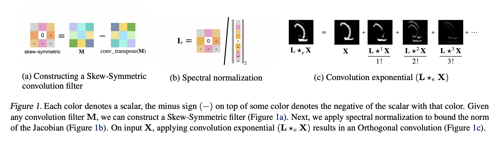
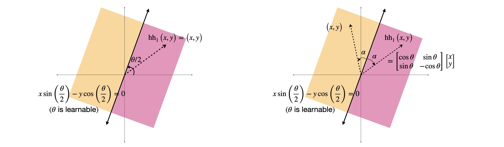

# Skew Orthogonal Convolutions

+ **Skew Orthogonal Convolution (SOC)** is a convolution layer that has an Orthogonal Jacobian matrix and achieves state-of-the-art standard and provably robust accuracy compared to the other orthogonal convolutions. 
+ **Last Layer normalization (LLN)** leads to improved performance when the number of classes is large.
+ **Certificate Regularization (CR)** leads to significantly improved robustness certificates.
+ **Householder Activations (HH)** improve the performance for deeper networks.

## Prerequisites

+ Python 3.7 or 3.8, Pytorch 1.8+
+ NVIDIA Apex. Can be installed using ```conda install -c conda-forge nvidia-apex```
+ A recent NVIDIA GPU

## How to train 1-Lipschitz Convnets?

```python train_robust.py --conv-layer CONV --activation ACT --num-blocks BLOCKS --dataset DATASET --gamma GAMMA```
+ CONV can be bcop/cayley/soc
+ ACT can be maxmin/hh1/hh2. hh1 is the householder activation of order 1, hh2 is the householder activation of order 2. Both are illustrated in Figures 1 and 2 in the paper titled "Improved deterministic l2 robustness on CIFAR-10 and CIFAR-100"
+ BLOCKS are an integer from 1 to 8
+ GAMMA is the certificate regularization coefficient
+ Use the flag ```--lln``` to activate last layer normalization
+ DATASET can be cifar10/cifar100.

## How to train Standard Convnets using Orthogonal Convolutions?
```python train_standard.py --conv-layer CONV --model-name MODEL --dataset DATASET```
+ CONV can be standard/bcop/cayley/soc
+ MODEL can be resnet18/resnet34/resnet50/resnet101/resnet152
+ DATASET can be cifar10/cifar100

## Demonstration of Skew Orthogonal Convolutions



## Demonstration of Householder Activations

*Demonstration of hh1 activation function*

## Citations
If you find this repository useful for your research, please cite:

```
@inproceedings{singlafeiziSOC2021,
  title={Skew Orthogonal Convolutions},
  author={Sahil Singla and Soheil Feizi},
  booktitle={ICML},
  year={2021}
}

@inproceedings{singla2022improved,
  title={Improved deterministic l2 robustness on {CIFAR}-10 and {CIFAR}-100},
  author={Sahil Singla and Surbhi Singla and Soheil Feizi},
  booktitle={International Conference on Learning Representations},
  year={2022}
}
```

